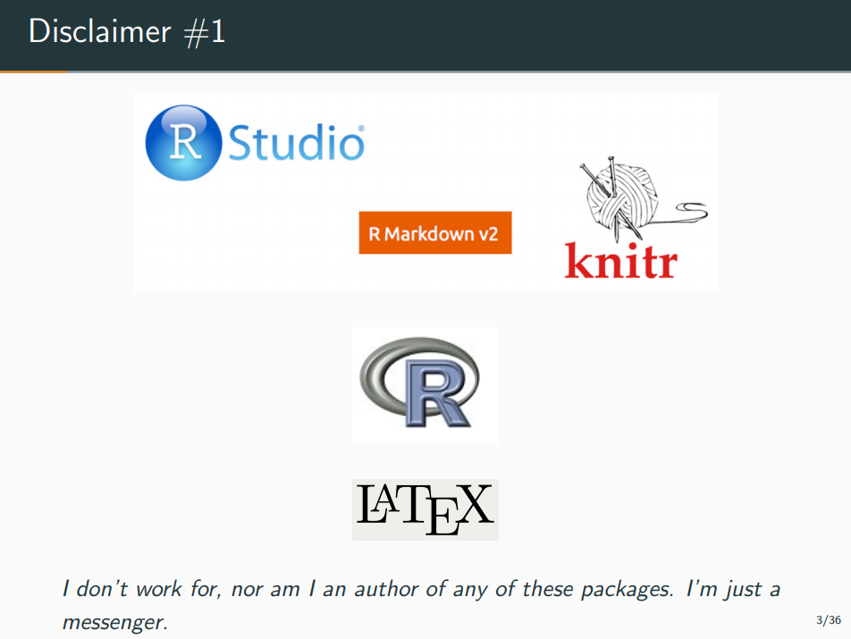
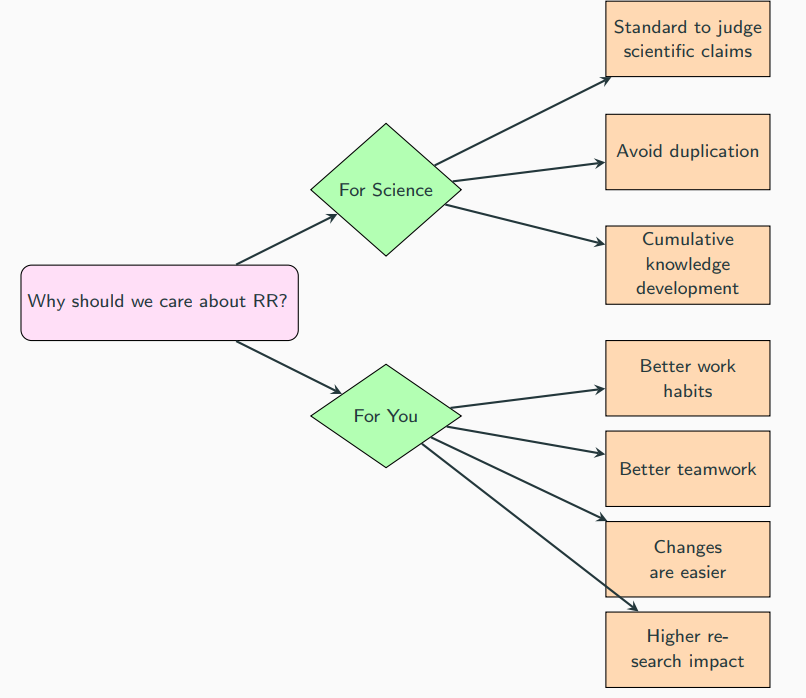
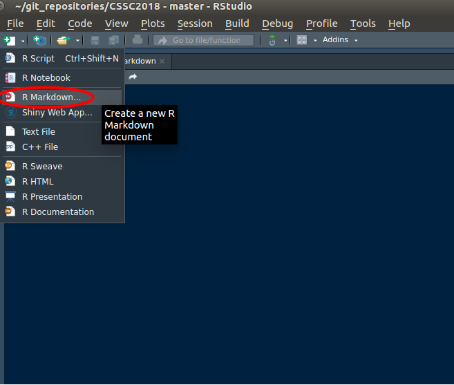
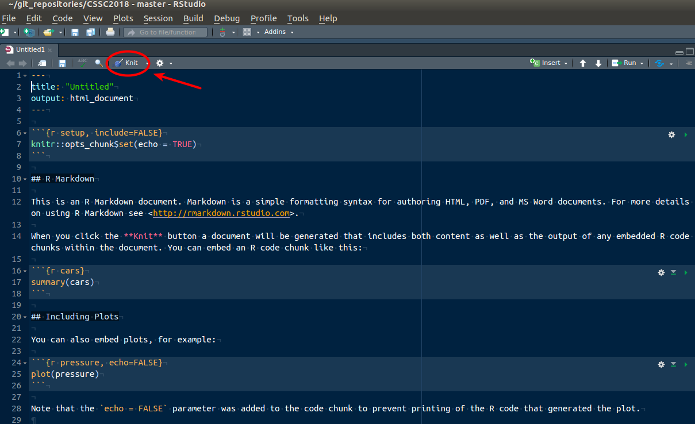
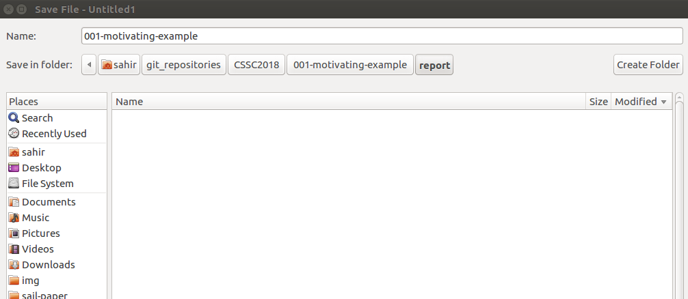
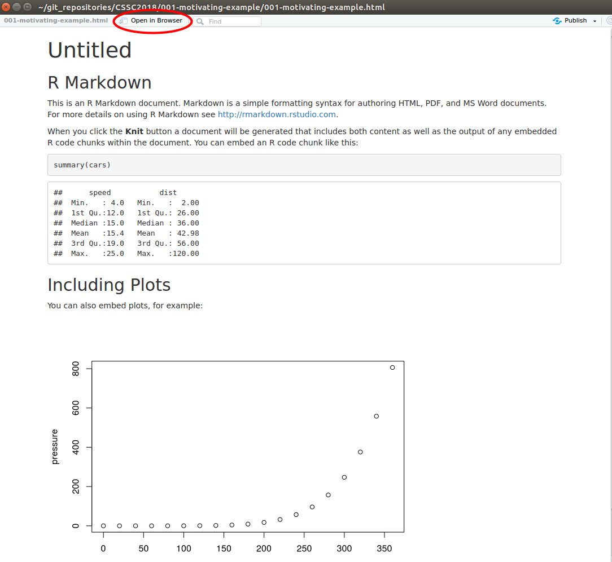
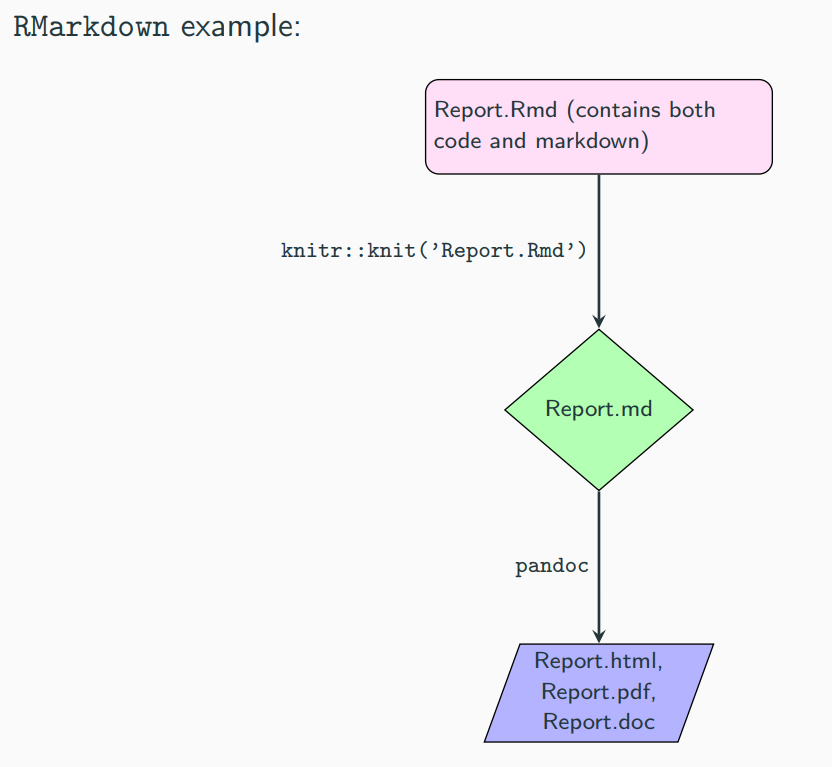
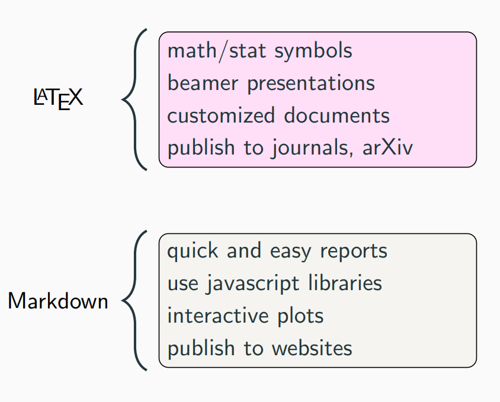
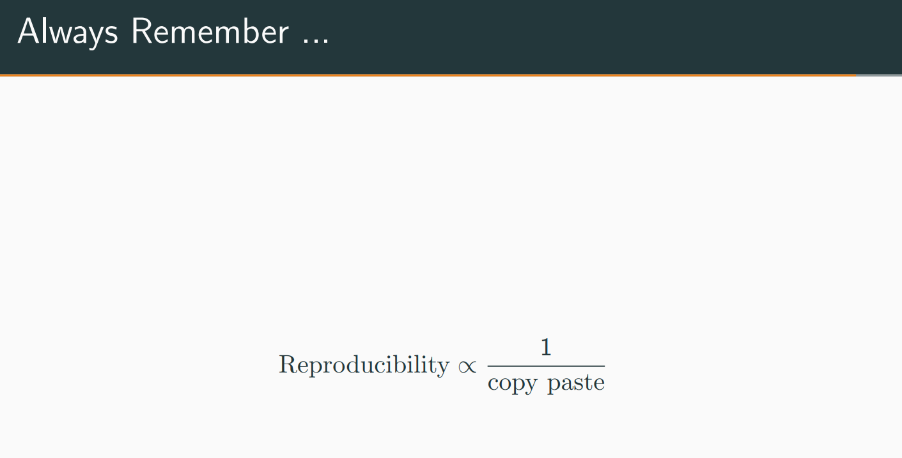

```{r knitr_init, echo=FALSE, cache=FALSE}
library(knitr)

# need to make sure this is installed
# to compile this document
# pacman::p_load_gh("juba/rmdformats")

## Global options
options(max.print="75")
opts_chunk$set(echo=FALSE,
	             cache=TRUE,
               prompt=FALSE,
               tidy=TRUE,
               comment=NA,
               message=FALSE,
               warning=FALSE)
opts_knit$set(width=75)
```


```{r init,  echo=FALSE, results="hide", eval=FALSE}
library(ProjectTemplate)

if (!file.exists(file.path("config", "global.dcf")))
    setwd("../..")
if (!exists("project.data.loaded")) {
    load.project()
    project.data.loaded <- TRUE
}
```


# Before We Get Started...

Please go to the following site to vote:

<span style="font-size:larger;">http://etc.ch/qJqU</span>

```{r, out.width='500px', out.height='500px', fig.fullwidth=TRUE, echo=FALSE}
knitr::include_graphics(path = "assets/img/qrcode.png")
```


# Requirements

* [R (version ≥ 3.4.1)](http://cran.r-project.org/)
* [RStudio (version ≥ 1.1.442)](http://www.rstudio.com/products/rstudio/download/preview/)  
* [Git](https://git-scm.com/downloads)
* [Sign up for a GitHub Account](https://github.com/)
* [GitKraken](https://www.gitkraken.com/) (_optional_)  
* Run the following commands in `R` for required packages:

<br>

```R
install.packages("pacman")
pacman::p_load(knitr, rmarkdown, bookdown, data.table, sjPlot, car)
pacman::p_load_gh('rstudio/blogdown')
```


<br>


# Objectives

By the end of this workshop you should:  

1. Be convinced reproducible research is important  
2. Become familiar with  
  - [`knitr`](https://yihui.name/knitr/)  
  - [`R Markdown`](https://rmarkdown.rstudio.com/)  
  - [`Git`](https://git-scm.com/)  
  - [`GitHub`](https://github.com/)  
3. Have a website


# Part 1: knitr and R Markdown {.tabset .tabset-fade .tabset-pills}

*************


## Standing on the shoulder of giants

> None of this would be possible without these trailblazers and the open source community

<br>


<br>





## Reproducible Research

### What is needed for Reproducible Research (RR) ?

<br>


*************


<br>


### Why RR?


<br>



*************

<br>


#### Division of Labor

> Focus on the stats, code, interpretation. Leave everything else (filling in tables, inserting plots, formatting) to the typesetter.  

<br>

```{r, echo=FALSE, fig.align='center'}
knitr::include_graphics(path = "assets/img/rmarkdown/smith.jpg")
```

Pictured above is **Adam Smith**, author of _The Wealth of Nations_ (1776), in which he conceptualizes the notion of the division of labour.


## R Markdown

### Markdown

> Markdown is to HTML what LaTeX is to TeX

Markdown was initially created by [John Gruber](https://daringfireball.net/) as a simple way for non-programming types to write in an easy-to-read format that could be converted directly into HTML.  


<br>

See the [Markdown cheatsheet](https://github.com/adam-p/markdown-here/wiki/Markdown-Cheatsheet) for syntax details.  


**Note**: All HTML is valid Markdown. If you're stuck not able to format your content how you would like you can always use plain [HTML](http://htmldog.com/guides/html/beginner/) instead of Markdown (e.g. use `<br>` for line breaks).  

*************

<br>


### R Markdown = R + Markdown 

R Markdown combines the computing power of R with the simplicity of Mardown syntax to generate high quality reproducible reports in various formats.  


See the [R Markdown cheatsheet](https://rmarkdown.rstudio.com/lesson-15.html) for syntax details.  
<br>


## Quick Start

We first start with a [minimal, complete, and verifiable example (MCVE)](https://stackoverflow.com/help/mcve) to ensure you have all the correct dependencies and updated versions of software installed. In Rstudio, create a new R Markdown document:



*************

<br>

Select `Document` and ensure that the default output format is `HTML`. Enter a title if you wish, but you can change this later. Click on `OK`:


*************

<br>

A default skeleton of R Markdown code is included everytime you create a new R Markdown document within RStudio. The important pieces of the document are highlited in the figure below. The `YAML` header is very similar to the header in LaTeX; it contains all the options for the document. The two mandatory pieces in the `YAML` are a title and the output format. See [here](https://rmarkdown.rstudio.com/html_document_format.html) for further customizations.


*************

<br>

Leave the content as is and click on the `knit` button:



*************

<br>


This will prompt you to save the file:



*************

<br>

An RStudio window of the compiled `HTML` file should appear



*************

<br>

The following figure shows exactly what happens when you press the `Knit` button. The `.Rmd` file is first converted into a markdown (`.md`) file, which is subsequently converted by a tool called [pandoc](https://pandoc.org/) into the format specified by `output:` in the `YAML`:



*************

<br>


## Remarks

### 1. How to choose between LaTeX and Markdown ?



*************


<br>

### 2. Rule of thumb



*************

<br>

### 3. Replicability


*************

<br><br><br>


# Part 2: Creating a Website {.tabset .tabset-fade .tabset-pills}

*************

## Introduction

Even until a couple of years ago, creating a website along with a blog that embeded both code and text, required specific knowledge of `HTML`. Tools such as [`markdown`](https://daringfireball.net/projects/markdown/syntax) and [`R Markdown`](https://rmarkdown.rstudio.com/), have abstracted the difficult part of writing `HTML` code for us, so that we can focus on content and creating reproducible analyses. Building on these very tools, the [`blogdown`](https://bookdown.org/yihui/blogdown/) package by [`Yihue Xie`](https://yihui.name/) has made it that much easier to create websites that allow you to showcase your scripts, code and reports, while also maintaining a public portfolio, i.e., **having an online presence**.  


In this part, we will create a minimal working example of a [`blogdown`](https://bookdown.org/yihui/blogdown/) website. I have provided detailed screenshots with annotations of each step. In general a red encircled annotation means you should click on it, and a red rectangular annotation means that you should verify or be aware of this. _Note: the screenshots provided here are from a Linux operating system, however it will be similar on a Windows or Mac._  


<br>


## Step 1: Create 2 git repos

We first need to create two GitHub repositories (abbreviated as repo). One will hold the source code for your website, and the other will host the compiled `HTML` files which make up your website (these are often referred to as static files). Head over to your GitHub account online and create a new repository:


*************

<br>

Give it a name. It can be anything you want such as `website`, `website_source`, `source` (just pick a name that will remind you that this repository contains the source files of your website). In the screenshots below I used `website` throughout. Check the box to initialize the repository with a README and then click on `Create repository`:


*************

<br>

You should now see the homepage of your repository. Note the URL for the repository is given by `https://github.com/<user-name>/<repo-name>`. This online version of this repo is called the `remote`.


*************

<br>

Click on the `Clone or download` green button and copy the URL to your clipboard:


*************

<br>

We now want a `local` copy of the `website` repo so that we can start creating content to put on our website. Head over to RStudio and go to `File --> New Project..`:


*************

<br>


Select `Version Control`:


*************

<br>

Then select `Git`:


*************

<br>

Paste the repository URL that you copied from your `remote` GitHub repo. Enter a project directory name (I call it the same as the repo name), and if you want, copy the files of the `remote` repo to a specific subdirectory: 


*************

<br>


You will notice that a `.Rproj` file was created and a `.gitignore` file was created. Let's first test to see if our connection from the `local` repo to the `remote` repo is working. We first check the boxes next to each file and click on `commit`:


*************

<br>

Enter a commit message and click on `Commit`:


*************

<br>

If everything went ok, you should see a window like this:


*************

<br>

Next we want to `Push` these local changes to the `remote`. Click on the `Push` button:


*************

<br>

This will prompt you to enter your GitHub username:


*************

<br>

... and password:


*************

<br>
If everything worked smoothly, you should see a window like this:


*************

<br>

Head over to the webpage for your GitHub repo (refresh the page if necessary) and you should see you commit message, as well as a `.gitignore` file and a `.Rproj` file. 


*************

<br>

We now need to repeat the exact same steps as before to create the second repo which will host the static files for your website. Create a local copy, though it is not yet necessary to push your changes to the `remote` as this will be done in a later step. 

**Note: the name of this repo must be** `<user-name>.github.io`.  


*************

<br>


*************

<br>


*************

<br>


*************

<br>


*************

<br>


*************

<br>


## Step 2: Install Hugo

<br>

**Note for Mac Users**: the first time you install Hugo, you might need to install homebrew. 


```{r, eval=FALSE, echo=TRUE}
library(blogdown)
blogdown::install_hugo(force=TRUE)
blogdown::hugo_version()
```

*************

<br>

### Choose a theme

Choose a theme from https://themes.gohugo.io/ and find the link to the theme's GitHub repository. In this example we choose the Academic theme. 


*************

Click on the `Homepage` button to get the link to the theme's GitHub repo:


*************

Only copy the `<user-name>/<repo-name>`:


*************

<br>

**From the local website repo** (i.e. the repo that will have the source code on your local machine), enter the following command, where `theme` corresponds to the link of the corresponding GitHub repo:

```{r, eval=FALSE, echo=TRUE}
blogdown::new_site(theme = "gcushen/hugo-academic", theme_example = TRUE)
```


*************

<br>

Click on the button encircled in red which should spawn a web page in your browser:


*************

<br>


Take a look at your website. It's only a local copy for now, and we still need to personalize it before publishing it.


*************

<br>

After this is complete, you should quit and then reopen the project. Upon reopening, RStudio will recognize the project as a website.


*************

<br>


*************

<br>

You should notice that there is now a `Build` button available:


## Step 3: Publish website

<br>

As explained in [this post](https://tclavelle.github.io/blog/blogdown_github/): 

> User pages on GitHub require all site content (and only site content) to be on the master branch. This is problematic for blogdown sites because when Hugo builds your website it places the site content in a new folder called public/. Thus, your blog’s source and site content will be on the master branch and GitHub will be unable to render your site.  

There are [two ways](https://tclavelle.github.io/blog/blogdown_github/) to get around this problem. In this tutorial we go with the option that requires the least amount of `Git` knowledge (the two repository method).  

As explained in Step 2, we create two repositories: one for the source code of the website and another for the static `HTML` files. The figure below demonstrates that you should have the following two folders on your local machine:


*************

<br>

Head over the the `website` source repo on your local machine and open the 
`config.toml` file. This is the configuration file for your website. This file tells Hugo how it should render your site, as well as define its menus, and set various other site-wide parameters. This file will look different for every theme, but they will all contain some basic components. The two most important ones for now are:  

1. `baseurl`: set this to the URL for your site `https://<user-name>.github.io/`  
2. `publishDir`: this tells blogdown which directory it should place the static files in. This directory will include a copy of everything that gets generated in the public/ directory of your site's root directory. Set this to `publishDir = "../<user-name>.github.io"`.  

Adjust this path to where ever you keep your `<user-name>.github.io` repository.  `publishDir` is relative to current directory. So you can use `../`, or use the full path (e.g. `"/home/sahir/git_repositories/cssc2018.github.io"`) but dont use `"~/git_repositories/cssc2018.github.io"`.  

Feel free to change the other self-explanotory options such as `title`, `name`, `role`, `organization` ect.  


*************

<br>

Notice that your local folder of the `<user-name>.github.io` doesn't have many files in it prior to building the website:


*************

<br>

Click on the `Build Website` button to render the site:  


*************

<br>

You should see a window of the rendered website (sometimes it shows up in the pop up windown and sometimes it doesn't, but don't worry just yet):


*************

<br>

If you have properly setup the `publishDir` in the `config.toml` file, you should now see many files in your local `<user-name>.github.io` folder:


*************

<br>

GitHub defaults to using [Jekyll](https://jekyllrb.com/) with website content, and this needs to be disabled since blogdown sites are built with Hugo. To disable this, include an empty file named `.nojekyll` in your GitHub repo `<user-name>.github.io`. You can do so within RStudio by opening a text file:


*************

<br>

Click on the save button:


*************

<br>

Save as `.nojekyll` in the root of your local repo:


*************

<br>

You might not notice the `.nojekyll` file show up in RStudio, but you should be able to see it in you file explorer:


*************

<br>

We now need to commit these changes and push them to GitHub. Check all the boxes in the `Staged` column:


*************

<br>

Click on `commit`:


*************

<br>

Enter a commit message and click on `Commit`:


*************

<br>


If everything worked, you should see a window like this:


*************

<br>


Click on `Push` which will then prompt you for your username and password:


*************

<br>


*************

<br>


*************

<br>


If everything worked, you should see a window like this:


*************

<br>


Head over to the remote repo. You should see your most recent commit message. Click on `Settings`:


*************

<br>

Scroll down. You should see that your site is now published. Be sure to check the `Enforce HTTPS` box. Read more about `HTTPS` [here](https://https.cio.gov/everything/). GitHub now support `HTTPS` for custom domain names and `<user-name>.github.io` subdomains.


*************

<br>

Head over to `https://<user-name>.github.io` and see your website in action!


*************

<br>

Be sure to also commit and push the changes to the source code of your website:


*************

<br>


*************

<br>


*************

<br>


*************

<br>

## Step 4: Create blog post

<br>

The next step is to create a blog post. This step is made easy by the RStudio `Addins` menu:


*************

<br>

Fill in the boxes. Be sure to check the `.Rmd` format:


*************

<br>

You should see the following `.Rmd` file in your RStudio:


Copy the following into the `.Rmd` file:

````
```{r setup, include=FALSE}`r ''`
knitr::opts_chunk$set(echo = TRUE)
```

# R Markdown

This is an R Markdown document. Markdown is a simple formatting syntax for authoring HTML, PDF,
and MS Word documents. For more details on using R Markdown see <http://rmarkdown.rstudio.com>.

When you click the **Knit** button a document will be generated that includes both content as 
well as the output of any embedded R code chunks within the document. You can embed an R code 
chunk like this:

```{r cars}`r ''`
summary(cars)
```

<br>

# Including Plots

You can also embed plots, for example:

```{r pressure, echo=FALSE}`r ''`
plot(pressure)
```

Note that the `echo = FALSE` parameter was added to the code chunk to prevent printing of 
the R code that generated the plot.  

<br>

# Math Equations

You can also input $\LaTeX$ equations:

$$
x_{FIS} =  \left(\prod_{g=1}^{6} SS_{i,g}^{C_{i,g}}\right)^\frac{1}{\sum{C_{i,g}}}
$$ 
````

Save the file. Click on `Build Website` and repeat the steps above (commit and push the changes of both the `website` repo and the `<user-name>.github.io` repo).


# Part 3: Project pages {.tabset .tabset-fade .tabset-pills}

*************


## Introduction

There are two basic types of GitHub Pages sites: [Project Pages sites](https://help.github.com/articles/configuring-a-publishing-source-for-github-pages/), and User and Organization Pages sites. They are nearly identical but have some important differences.  

Project Pages sites are connected to a specific project, and the site files live on a branch within the project repository. User and Organization Pages (e.g. `https://<user-name>.github.io`) sites are not tied to a specific project, and the site files live in a special repository dedicated to GitHub Pages files.  

The source files for Project Pages sites live within the same repository as their project, and they are published from one of the following locations:  

- The `master` branch  
- The `gh-pages` branch  
- A folder named `docs` located on the master branch  

Project pages allows you to host a report on the web with the URL: `https://<user-name>.github.io/project-page`  


## Example

All it takes is an `HTML` file called `index.html` with the content, and an empty file called `.nojekyll`.  

This document is an example of a project page. See https://github.com/sahirbhatnagar/CSSC2018 for details. 


# References 

## knitr and R Markdown

1. https://github.com/sahirbhatnagar/knitr-tutorial


## blogdown

1. https://tclavelle.github.io/blog/blogdown_github/  
2. http://www.emilyzabor.com/tutorials/rmarkdown_websites_tutorial.html#blogs  
3. https://bookdown.org/yihui/blogdown/  


# Acknowledgements


- Félix-Antoine Fortin (Calcul Québec)  
- Maxime Turgeon  (Scientific Program)  
- Kevin McGregor  (Local Arrangements)  
- Marie-Christine Robitaille Grou and Steve Ferreira Guerra (Traduction)  
- Janie Coulombe and Katherine Daignault (Co-présidentes)  
- Entire CSSC 2018 Organizing Committee and Volunteers  


